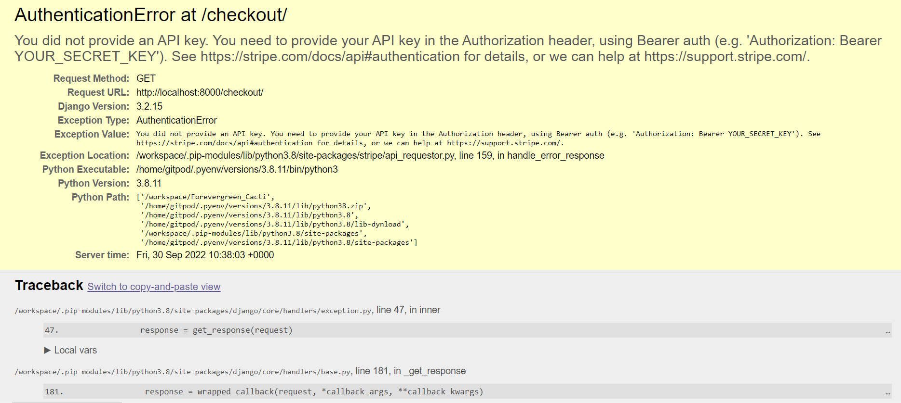
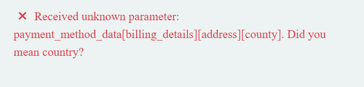

<!-- TOC -->
# Forevergreen Cacti

A link to the deployed website can be found <a href="#" alt="link to deployed heroku website">here</a>.

<!-- TOC -->
## Table of Contents
<!-- TOC start -->
- [Forevergreen Cacti](#forevergreen-cacti)
  * [Table of Contents](#table-of-contents)
    + [Project Design](#project-design)
    + [User Experience](#user-experience)
    + [Goals](#goals)
    + [User Stories](#user-stories)
    + [Wireframe](#wireframe-1)
    + [current Features](#current-features)
    + [Future Features](#future-features)
    + [Languages Used](#languages-used)
    + [Technology Used](#technology-used)
    + [Testing](#testing)
      - [Validation Testing:](#validation-testing)
    + [Bugs:](#bugs)
      - [Fixed Bugs:](#fixed-bugs)
      - [Unfixed Bug:](#unfixed-bug)
    + [Deployment:](#deployment)
    + [References:](#references)
    + [Acknowledgements](#acknowledgements)
<!-- TOC end -->
 

<!-- TOC -->
### Project Design

- <a href="https://balsamiq.com/wireframes/">Balsamiq wireframes</a> was used to design the wireframes used in the design phase of this project. 

| Page | Wireframe |
| --- | --- |

- <a href="https://www.lucidchart.com/" >Lucid Charts</a> was used to design the unique models used in this project.

 

#### Colour Scheme
- Colours were chosen using 

 

<!-- TOC -->
## User Experience
<!-- TOC -->
### Goals
- The main goal of the Forevergreen Cacti is to sell a wide range of cacti and succulents. 

#### Personal Goals
My personal goals for this project are that:
- The site is easy to navigate and user friendly.
- The purpose of the site is evident and inviting to users.
- That users want to create an account and engage with its content. 
- The platform that enables the user to find and purchase the product they are looking for.
- The site is presentable and appealing to increase aesthetic appeal.

#### Target Audience 
- Users aged 18 and over
- Users with an interest in growing cacti and succulents.

#### Customer Goals
- Finding product that fits their taste
- Buy product through an easy and secure payment flow
- See their previous purchases

 

<!-- TOC -->
### User Stories
As a user I want to:
- 

As an Admin I want to: 
- 

 

<!-- TOC -->
### Agile Design
- An Agile Approach was used to develop this site. This was achieved by breaking the project down into smaller tasks and assigning each of those tasks labels based on priority. 

To complete the overall aim of the Forevergreen Cacti store concept, 25 issues were documented as specific tasks called User Stories. These User Stories are small sections of the project designed to accomplish a specific goal. 
The acceptance criteria I followed when completing this development project was that if when completing and testing each User Story, the task was completed successfully such as adding an item to the cart or logging in and out of the site then I deemed the passing conditions met. Once the User Story was working effectively it was moved across the Kanban board. 

As mentioned above this project used a Kanban board, which was set up in my <a href="https://github.com/users/AmyDelaney94/projects/2" alt="link to Kanban Board">GitHub Projects here</a>, to help keep track of the work that was left to do, that was in progress and that was completed.

Examples of how my project progressed through the use of the Kanban board can be seen below.
| Week | Board |
| --- | --- |

 

<!-- TOC -->
### Current Features
The user stories mentioned above were used to ensure a positive UX was achieved.

| Feature | Details | Example |
| --- | --- | --- | 
| Favicon | - The favicon image was selected to continue with the cactus theme of the site.   - The favicon icon is visible in the browser tab and search engine history.  - It adds a unique identifier to the site. |  | 
| Landing Page |  |  | 
| Sign in Page |  |  |
| Sign up Page |  |  |
| About Us Page | - Aim and purpose of the page is displayed here.   - Tips for site navigation and log in benefits are also displayed here.  - Link to the homepage and signup page are also embedded in the text. |  |
| Shop Page |  |  |
| My Profile |  |  |
| Newsletter |  |  |
| SHopping Cart |  |  |
| Checkout |  |  |
| Checkout Success Page |  |  |
| Search Bar |  |  |
| Main Navigation | - The navigation bar changes depending on user status, with one view if logged in and a second view if logged out.   - The nav bar is responsive on smaller screen sizes it changes to a button with a dropdown list.| |
| Secondary Navigation |  |  |
| Footer |  |  |
| Admin Panel | - A superuser was created for this project to manage the administration section. - Admin users have more functionality than regular users and have full CRUD functionality over information such as users, posts and comments.   - Only approved admin users can access this section of the site. It is accessed by adding /admin to the URL home page and signing in or my selecting the link available from the My Profile tab in the navigation bar. |  |
| Product Detail |  |  |
| Product filters | - This feature allows the user to filter by Product Category   - Each product is assigned a tag that acts as an additional filter |  |
| Stripe | - Secure Payments   -  |  |
| Toasts |  |  |
| Pagination |  |  |
| Review Feature | - If the author of a review is logged in they have the option to either edit or delete their review.  - The edit and delete buttons are the same colour theme as the rest of the site and redirect the user to the selected page.||

 

<!-- TOC -->
### Future Features
Given more time to work on this project the overall scope of the website could be expanded. 
-  

 

<!-- TOC -->
### Languages Used
- Python: Language chosen to develop the interaction with the server. 
- JavaScript: Language chosen to run scripts in the project.
- HTML: Markup language used to create the front end web pages.
- CSS: Styling language used to add custom styling to site.
 

<!-- TOC -->
### Technology Used
| Type | Technology | Function |
| --- | --- | --- | 
|Framework | Django| python framework used to create backend logic |
|Framework | Bootstrap5 | CSS Framework for developing mobile-first responsiveness across multiple screen sizes |
| Library | Django-allauth | Authentication library used to create the user accounts| 
| Application | Crispy Forms |  Used to manage Django Forms without having to re-write templates |
| Application | Psycopg2 | Database driver used to connect to the database to Python code | 
| Database | SQLite|  used as the database during development|
| Database | PostgreSQL| The database used to store all the data on deployment site | 
| Other Resources | Chrome DevTools | Used to debug and view changes | 
| Other Resources | Balsamiq Wireframes| Chosen to design wireframes during project planning | 
| Other Resources | LucidCharts |  Used to create models used in the project | 
| Other Resources | Font Awesome | Used for visual icons on the site to enhance UX | 
| Other Resources |  | Used to choose the colour scheme for the site.
| Other Resources | Am I Responsive? | Used to see responsive design throughout the process.
| Other Resources | Django Summernote | Used to provide users with a more interactive text field.
| GitHub | GitHub Projects | Used to visually track the progress of the project | 
| GitHub | GitHub Issues | Used to create the user stories managed in GitHub Projects | 
| Host | GitHub | To store the source code and ReadMe for the project | 
| Host | GitPod | IDE selected to build the project | 
| Host | Heroku | To Host the deployed website | 
| Package Manager | Pip3 | Used to install extra software not found in Python Library
 

<!-- TOC -->
### Testing
| Feature Tested| Testing Method | Example | Result |  
| --- | --- | --- | --- | 

<!-- TOC -->
#### Validation Testing:
| Resource Used | Code Tested | Example | Result |  
| --- | --- | --- | --- | 

 

#### Lighthouse Testing
- The site was also tested for its <a href="https://web.dev/performance-scoring/"> Lighthouse Performance Score </a>and the results were as follows.

 

<!-- TOC -->
### Bugs:

<!-- TOC -->
#### Fixed Bugs:
| Bug | Appearance | Solution |
| --- | --- | --- | 
| Stripe API error |  | - Updated my env.py file with the correct syntax. |
| Checkout error |  | - To fix this issue I went back and updated the profile and checkout models to have a country field by installing django_countries.   - From there I updated the fields in my stripe_elements.js page which resolved the error. |
| Messages appearance | | - |

<!-- TOC -->
#### Unfixed Bug:
- 

 

<!-- TOC -->
### Deployment:
Heroku was used to deploy the site and it was achieved by following the steps below:
  1.	Go to the Heroku's website.
  2.	Create an account if required or select log in.
  3.	From the Heroku dashboard, click on the “New” button in top righthand corner then "Create new app".
  4.	Enter a unique "App name" and "Choose a region" before clicking on "Create app".
  5.	Go to "Config Vars" under the "Settings" tab.
  6.	Click on "Reveals Config Vars" and enter the following information:
	      - CLOUDINARY_URL : add your cloudinary key here.
        - DATABASE_URL : add the url from postgres database.
        - SECRET_KEY = a secret key for your app.
        - PORT : 8000
        - DISABLE_COLLECTSTATIC = 1 during development (Remove when deploying production!)
  7.	Go to "Buildpacks" section and click "Add buildpack".
  8.	Select "/herokupython" and click "Save changes"
  9.	Go to "Deployment method", under the "Deploy" tab select "GitHub" and click on "Connect to GitHub".
  10.	Go to "Connect to GitHub" section and "Search" the repository to be deployed.
  11.	Click "Connect" next the repository name.
  12.	Choose "Automatic deploys" or "Manual deploys" to deploy your application.
  13. Select the correct branch for deployment from the drop-down menu and click Deploy Branch for manual deployment.
- Note: Ensure in Django settings, DEBUG is False, create a Procfile and save database and secret key to env.py.
   
- Project Version Control – Git was used to control the versions of the project during development. Changes were added, committed, and  saved using commands such as ‘git add .’ and ‘git commit’, and ‘git push’. Once changes had been committed, they were pushed and stored  on the GitHub repository with the rest of the projects source code. 
 
- Cloning - To clone this repository from GitHub to a local computer to make it easier to fix merge conflicts, add or remove files, and push larger commits or contribute use the following steps:

1. On GitHub, navigate to the main page of the repository.
2. Above the list of files, click Code.
3. Click Use GitHub CLI, then the copy icon.
4. Open Git Bash and change the current working directory to the location where you want the cloned directory.
5. Type git clone, and then paste the URL that was copied from step 3 above.
6. Press Enter to create the local clone.
 
- Forking - A fork is a copy of a repository. Forking a repository allows you to experiment with changes without affecting the original project. To fork this project, go to the top left of the repository, where you see the Fork Icon and click Fork. This will create a copy of the repository for you.
 

<!-- TOC -->
### References:
- <a href="https://favicon.io/emoji-favicons/cactus/"> Favicon.io</a> was used as a source for the favicon image used in this project. 
- <a href="https://lucid.app/documents#/documents?folder_id=home" alt="Link to lucid charts site">Lucid Charts</a>
- <a href="https://stackoverflow.com/questions/53067186/how-to-use-slugs-in-django-url" alt="Link to stack overflow site">Stack Overflow</a> -> Using Slugs in Django
- <a href="https://www.w3schools.com/bootstrap5/bootstrap_cards.php">W3Schools</a> -> Using cards in Bootstrap 5. 
- <a href="https://getbootstrap.com/docs/5.0/getting-started/introduction/" alt="Bootstrap Documentation">Bootstrap Documentation</a> -> For implementing bootstrap throughout the project
- <a href="https://docs.djangoproject.com/en/3.2/ref/contrib/messages/#using-messages-in-views-and-templates" alt="Django Messages Information">Django Messages</a>
- <a href="https://django-allauth.readthedocs.io/en/latest/" alt="Allauth Documentation">AllAuth Documentation</a>
- <a href="https://www.youtube.com/c/TheNetNinja" alt="net ninja django tutorials">NetNinja Django Tutorials</a>

 

<!-- TOC -->
### Acknowledgements
- First, I would like to thank my Partner for his love and support throughout the completion of this project.
- I would also like to thank my mentor Marcel for his advice and support.
- My friends for constantly testing the project.
- Tutor Assistance for their help and support.
- Code Institute and its Slack community for its support in troubleshooting. 
- Code Institutes learning materials for its tutorials and examples and providing me with the necessary knowledge to complete this project. 