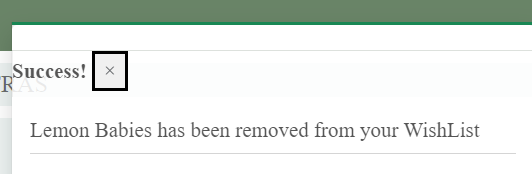

<!-- TOC -->
# Forevergreen Cacti

### Overview of the Project.
Forevergreen Cacti is a website for a fictitious online store that specialises in the selling of cacti and succulents. This site allows users to view, review and purchase products that are available to be shipped to them. While this is a fictitious site the logic and design can be used for multiple online stores that can take payments.

This site allows users to search for a specific product or filter the available products by a number of categories such as height and preferred climate, they can read reviews, read the product descriptions and view care tips for each product, Users also have the opportunity to set up a profile where they can view their purchase history, save their contact information, and view their wishlist. In the footer of the site, there is also the option to enter an email to subscribe to the newsletter.

Users can make online purchases either once they are logged-in. Once payment is successful, the user is sent an email confirmation of their purchase and their order number which is unique to them.

Site admin users can add, update and delete products from the admin site.

A link to the deployed website can be found <a href="https://forevergreen-cacti.herokuapp.com/" alt="A link to deployed heroku website">here</a>.

<!-- TOC -->
## Table of Contents
<!-- TOC start -->
- [Forevergreen Cacti](#forevergreen-cacti)
  * [Table of Contents](#table-of-contents)
    + [Project Design](#project-design)
    + [User Experience](#user-experience)
    + [Goals](#goals)
    + [User Stories](#user-stories)
    + [Wireframe](#wireframe-1)
    + [current Features](#current-features)
    + [Future Features](#future-features)
    + [Languages Used](#languages-used)
    + [Technology Used](#technology-used)
    + [Manual Testing](#manual-testing)
      - [Validation Testing:](#validation-testing)
    + [Web Marketing:](#web-marketing)
    + [Bugs:](#bugs)
      - [Fixed Bugs:](#fixed-bugs)
      - [Unfixed Bug:](#unfixed-bug)
    + [Deployment:](#deployment)
    + [References:](#references)
    + [Acknowledgements](#acknowledgements)
<!-- TOC end -->
 

<!-- TOC -->
### Project Design

- <a href="https://balsamiq.com/wireframes/">Balsamiq wireframes</a> was used to design the wireframes used in the design phase of this project. 

| Page | Wireframe |
| --- | --- |
| Landing Page |  |
| About Page | |
| Shopping Cart |   |
| Checkout Page |  |
| Product Description |  |
| Products Page |  | 
| Profile Page | |
| Wishlist Page |   |

- <a href="https://www.lucidchart.com/" >Lucid Charts</a> was used to design the unique models used in this project.

#### Colour Scheme
- Colours were chosen using <a href="https://coolors.co/">Coolors</a>.

 

<!-- TOC -->
## User Experience
<!-- TOC -->
### Goals
- The main goal of Forevergreen Cacti is to sell a wide range of cacti and succulents. 

#### Personal Goals
My personal goals for this project are that:
- The site is easy to navigate and user-friendly.
- The purpose of the site is evident and inviting to users.
- That users want to create an account and engage with its content. 
- The platform that enables the user to find and purchase the product they are looking for.
- The site is presentable and appealing to increase aesthetic appeal.

#### Target Audience 
- Users aged 18 and over
- Users with an interest in growing cacti and succulents.

#### Customer Goals
- Finding a product that fits their taste
- Buy products through an easy and secure payment flow
- See their previous purchases

 

<!-- TOC -->
### User Stories
As a user I want to:
- 

As an Admin I want to: 
- 

 

<!-- TOC -->
### Agile Design
- An Agile Approach was used to develop this site. This was achieved by breaking the project down into smaller tasks and assigning each of those tasks, labels based on priority. 

To complete the overall aim of the Forevergreen Cacti store concept, 25 issues were documented as specific tasks called User Stories. These User Stories are small sections of the project designed to accomplish a specific goal. 
The acceptance criteria I followed when completing this development project was that if when completing and testing each User Story, the task was completed successfully such as adding an item to the cart or logging in and out of the site then I deemed the passing conditions met. Once the User Story was working effectively it was moved across the Kanban board. 

As mentioned above this project used a Kanban board, which was set up in my <a href="https://github.com/users/AmyDelaney94/projects/2" alt="link to Kanban Board">GitHub Projects here</a>, to help keep track of the work that was left to do, that was in progress and that was completed.

Examples of how my project progressed through the use of the Kanban board can be seen below.
| Week | Board |
| --- | --- |

 

<!-- TOC -->
### Current Features
The user stories mentioned above were used to ensure a positive UX was achieved.

| Feature | Details | Example |
| --- | --- | --- | 
| Favicon | - The favicon image was selected to continue with the cactus theme of the site.   - The favicon icon is visible in the browser tab and search engine history.  - It adds a unique identifier to the site. |  | 
| Landing Page | - The landing page contains the header, navigation, and footer   - This page was designed to highlight the various categories of cacti available in the store to allow the user to easily navigate to the desired selection.   - The landing page also provides the user with the option to navigate directly to the main products page |   | 
| Sign-in Page | The sign-in page provides the user with a sign-in form requesting a username or email and a password. | 
| Sign-up Page | The sign-up page provides the user with a sign-up form to create a user profile. |  |
| Logout Confirmation Page | The user is asked to verify if they are sure they wish to log out. |  |
| About Us Page | - Aim and purpose of the page are displayed here.   - Tips for site navigation and login benefits are also displayed here.  - Links to the homepage and signup page are also embedded in the text. |  |
| Shop Page | - The shop page shows all products available to the user and can be filtered by category, cost and A-Z, etc. |  |
| My Profile | - The profile tab has various views depending on login status and if the user is an admin.   - The my profile page contains the order history of a user and their address details. |  |
| Wishlist | - The wishlist allows the user to save products in a list that is accessed in the profile menu. |  |
| Newsletter | - The newsletter option allows users to subscribe to the newsletter and prevents them from subscribing multiple times. |  |
| Shopping Cart | - The shopping cart display contains the image, product name, quantity, and total cost to the user. |  |
| Checkout | The checkout page is a section of the site that requests the user's shipping and payment details. It also provides a summary of the products being purchased by the user. |  |
| Checkout Success Page | -This page provides the user with a summary of their order, the shipping details, and the overall cost. |  |
| Search Bar | - The search bar allows users to search for products on the site. |   |
| Main Navigation | - The navigation bar options change depending on user status, with one view available if logged in and a second view if logged out.   The main navigation bar also features a search bar. |  |
| Secondary Navigation | - This secondary navigation bar has four options available each with a number of options to assist the user in filtering their choice.   - The nav bar is responsive on smaller screen sizes it changes to a toggle with a dropdown list. |  |
| Footer | - The footer contains the newsletter signup option, social media links, a link to the privacy policy, and site details. |  |
| Admin Panel | - A superuser was created for this project to manage the administration section. - Admin users have more functionality than regular users and have full CRUD functionality over information such as users, posts, and comments.   - Only approved admin users can access this section of the site. It is accessed by adding /admin to the URL home page and signing in or by selecting the link available from the My Profile tab in the navigation bar. |   |
| Product Detail | - The product details page contains an image of the product, the name, description and care tips, and the cost.   - It also shows the number of reviews on the page, an option for logged-in users to leave a review, and a summary of any reviews left on the page. |   |
| Product filters | - This feature allows the user to filter by Product Category   - Each product is assigned a tag that acts as an additional filter   - The individual categories can also be filtered A-Z and by cost etc. |   |
| Stripe | - Stipe was implemented to ensure Secure Payments   - A stripe developer account was created at <a href="https://stripe.com/">Stripe.com</a> to gain access to the api keys required to run the payment processes.   - The stripe public key, stripe secret key and stripe webhook key were inserted into the env.py file and the heroku config vars.   - Stripe documentation was followed to impliment Stripe as the payment platform. |  |
| Toasts | - Toasts are used to communicate notifications to the user, examples include logging in and out and adding items to the shopping cart. |  |
| Review Feature | - If the author of a review is logged-in they have the option to either edit or delete their review.  - The edit and delete buttons are the same colour theme as the rest of the site and redirect the user to the selected page.|   |
| Error Pages |- This feature was added to provide the site with customised error pages that are in theme with the main site.   - The error pages included were error 400 - bad request, error 403 - No permission to access content, error 404 - Page not found and error 500 - internal server error ||
| Privacy Policy | - This feature was added to ensure that the site complies with GDPR.   - There is a link for users in the footer that directs them to the policy.|  |

 

<!-- TOC -->
### Future Features
Given more time to work on this project, the overall scope of the website could be expanded:  
-  I would redirect the user to the page of the review being updated instead of the main store page. 
- I would provide the admin with access to update the product database from the store rather than navigating to the admin panel. 
- Sign in with social media. 
- Automatic login after registraion verification - given more time this feature could be implitmented by importing login from django.contrib.auth. 
- Email after subscribing to verify the email address
- Newsletter - option to unsubscribe from newsletter 
- Users can add rating or likes to products. 

 

<!-- TOC -->
### Languages Used
- Python: Language chosen to develop the interaction with the server. 
- JavaScript: Language chosen to run scripts in the project.
- HTML: Markup language used to create the front-end web pages.
- CSS: Styling language used to add custom styling to the site.

 

<!-- TOC -->
### Technology Used
| Type | Technology | Function |
| --- | --- | --- | 
|Framework | Django| python framework used to create backend logic |
|Framework | Bootstrap5 | CSS Framework for developing mobile-first responsiveness across multiple screen sizes |
| Library | Django-allauth | Authentication library used to create the user accounts| 
| Application | Crispy Forms |  Used to manage Django Forms without having to re-write templates |
| Application | Psycopg2 | Database driver used to connect the database to Python code | 
| Database | SQLite|  used as the database during development|
| Database | PostgreSQL| The database used to store all the data on the deployment site | 
| Other Resources | Chrome DevTools | Used to debug and view changes | 
| Other Resources | Balsamiq Wireframes| Chosen to design wireframes during project planning | 
| Other Resources | LucidCharts |  Used to create models used in the project | 
| Other Resources | Font Awesome | Used for visual icons on the site to enhance UX | 
| Other Resources | Coolors | Used to choose the colour scheme for the site.
| Other Resources | Am I Responsive? | Used to see responsive design throughout the process.
| Other Resources | Django Summernote | Used to provide users with a more interactive text field.
| GitHub | GitHub Projects | Used to visually track the progress of the project | 
| GitHub | GitHub Issues | Used to create the user stories managed in GitHub Projects | 
| Host | GitHub | To store the source code and ReadMe for the project | 
| Host | GitPod | IDE selected to build the project | 
| Host | Heroku | To Host the deployed website | 
| Package Manager | Pip3 | Used to install extra software not found in Python Library
 

<!-- TOC -->
### Manual Testing
| Feature Tested| Testing Method | Example | Result |  
| --- | --- | --- | --- | 
| Registration - Blank Field | - Each mandatory field was left blank intentionally to ensure alert appeared || Pass |
| Registration - Invalid Email Field |- An invalid email address was tested to ensure error message appeared|| Pass |
| Registration - Common Password | - A common password was tested to check security|| Pass |
| Registration - Short Password |- A short password was tested to check that an error appears if less than 8 characters entered || Pass |
| Registration - Short Username |- A short username was tested to check that an error appears if less than 4 characters are entered || Pass |
| Registration - Email Verification |- When new account is set up user should be asked to verify the email address before logging in for the first time. || Pass |
| Registration - Email Confirmation |- When new account is set up user should be sent a verification email to the email address used during registration.|| Pass |
| Sign-In - - Blank Field |- Each mandatory field was left blank intentionally to ensure alert appeared || Pass |
| Sign in - Incorrect Username Field | - Tested with incorrect spelling and capitalisation of some letters to ensure account security || Pass |
| Sign in - Incorrect Password Field | - Tested with incorrect spelling and capitalisation of some letters to ensure account security || Pass |
| Non-Signed in user - review |- The review section of the product details page is only available to logged in users and users that are not logged in are redirected to sign in page.|  | Pass | 
| Non-Signed in user - product detail |- The product details page is only available to logged in users and users that are not logged in are directed to sign in page.|  | Pass | 
| Non-Signed in user - Profile menu |- Only logged in users have access to full profile menu options | | Pass | 
| Signed in user - review |- The product details page shows the number of reviews on the page and review text box. |  | Pass | 
| Signed in user - product detail |- The product details page contains correct information about the product. |  | Pass | 
| Signed in user - Profile menu |- Only logged in users have access to full profile menu options | | Pass | 
| Signed in user - Profile menu Admin |- Only admin can see the link to admin site || Pass |
| Signed in user - Checkout | - Correct details are displayed on checkout screen and payment details not stored |  | Pass |
| Signed in user - Review Not Author |- Only review authors have access to edit or delete reviews | | Pass |
| Signed in user - Update or Delete own review | - Author of review shown edit or delete options for their reviews || Pass |
| Update a review - Pre-populated Data |- When update review is selected the text box should be pre-populated with the original information. || Pass |
| Delete a review - author| - confirmation of review delete || Pass |
| Update User Profile - Pre-populated Data |- Delivery address and contact information is pre-populated from previous orders and available to be updated by user | | Pass | 
| Site Alert - sign in |- Alert to confirm User successfully signed in.|| Pass |
| Site Alert - sign out |- Alert requests user to confirm choice before logging out of site. |  | Pass | 
| Site Alert - sign out |- Alert to confirm successful signing out. || Pass |
| Site Alert - review update |- Alert to confirm review update was successful. || Pass |
| About Page - Links | Testing if signup and home page link are activated. Both of these links are active and take the user to the correct location on the site when selected. | | Pass | 
| Newsletter | - Field must be completed with valid email address for submission to be accepted. | | Pass | 
| Wishlist - add from profile page |- Products can be added to wishlist by selecting them on the User profile Update form || Pass | 
| Wishlist - remove |- Products can be removed from wishlist by selecting button on wishlist menu || Pass | 
| Wishlist - remove alert | - Products removed successfully from wishlist || Pass |
| Wishlist - add from store | - Products can be added to wishlist directly from the store || Pass | 
| Cart - product added ||||
| Cart - quantity updated ||||
| Cart - product removed ||||
| Checkout view | |||
| Checkout incomplete details |||| 
| Checkout - save details |||| 
| Stripe - incorrect number ||||
| Stripe - incomplete date |- Only cards with completed valid date can be accepted for payments || Pass |
| Stripe - expired card | - Only cards with expiry date in the future can be accepted for payments || Pass |
| Stripe - incomplete security code ||||
| Stripe - incomplete ZIP code ||||
| Update User Profile - Pre-populated Data |- Pre saved data available on profile page.| | Pass |
| User Profile - Order History |- Order history available on profile page.| | Pass |
| Order Confirmation - notification ||||
| Order Success Page | -This page provides the user with a summary of their order, the shipping details, and the overall cost. |  | Pass | 
| Order Confirmation Email - email receipt ||||
| Admin CRUD functionality | - The admin account has access to create, update and delete products, user information, newsletter subscribtions etc | | Pass | 
| Admin - restricted access | - Only the admin account can log into the admin view panel. || Pass |

 

<!-- TOC -->
#### Validation Testing:
| Resource Used | Code Tested | Example | Result |  
| --- | --- | --- | --- | 
| <a href="https://jshint.com/">JSHint </a>  |JavaScipt files | | Pass - missing semicolons added and repeat testing passed. |
| <a href="https://jigsaw.w3.org/css-validator/#validate_by_input"> W3C CSS Validator </a> | All CSS files |  | Pass | 
| <a href="https://validator.w3.org/nu/#textarea"> Html Checker  </a>| All HTML source code was validated | | Pass - two stray / and a warning for unnecessary type attribute for JavaScript resources were identified and corrected during the validation process. | 
| pycodestyle | all files containing Python code |  | Pass * | 

* Pep8 Validation was completed using the following steps. 
  1.	Run the command pip3 install pycodestyle  
  2.	In the workspace, press Ctrl+Shift+P (or Cmd+Shift+P on Mac).
  3.	Type the word linter into the search bar that appears and click on Python: Select Linter from the filtered results. 
  4.	Select pycodestyle from the list. 
  5.	PEP8 errors will now be underlined in red, as well as being listed in the PROBLEMS tab beside your terminal.
-	All errors were resolved, and no problems were detected in the workspace as per the above image with the following exceptions:
    -	Webhook_handlers.py lines 103 and 147 were too long however, this error was unable to be resolved due to syntax compliance. 
    - Settings.py lines 148,151,154, and 157 all identified as being too long, this error was unable to be resolved due to syntax compliance.

 

#### Lighthouse Testing
- Lighthouse was used to check perfomance and accessiblitiy. Colour of the product buttons was adjusted to improve contrast ratio. 

 

#### Security
- All SECRET access keys are stored safely in the env.py file to prevent unwanted connections to the database. 
- Django’s setting DEBUG was set to False after development for deployment to prevent access to error screens revealing code or database entries.
- Django allauth was used to set up user registration and Django’s LoginRequiredMixin and UserPassesTestMixin were used to ensure only signed-in users and authors can edit and delete their product reviews.
- Cross-Site Request Forgery (CSRF) tokens were used on all forms throughout this site to prevent valid requests to the backend server from being created for malicious purposes.

 

<!-- TOC -->
### Web Marketing: 
#### Company description: 
- Forevergreen Cacti is a B2C company that provides our customers with an online cacti store that specialises in rare and unique species. Additionally, we provide information on cacti descriptions and care tips and tricks for the various species. Web marketing is the process of marketing a business online, and it's a cost-effective way to reach people who are most interested in what a business has to offer.
 
The following details the Web Marketing strategies used for this project:

#### Site Engine Optimisation
- An XML sitemap was created and added to the project's root directory. This is a file that lists the website’s important page URLs, making sure that search engines can crawl, or navigate, through them. It also helps search engines understand the website structure, so can help speed up content discovery.
- The robots.txt file was also created and added to the project's root directory. This is a text file that prohibits search engines from accessing  certain areas of the website. It lists out any folders or files that will not be crawled or indexed by search engine spiders. The presence of the robots.txt file shows that the site acknowledges that search engines are allowed and that they may have free access to it. For this reason, search engines take the existence of this file as a sign of quality, and so positively impact the SEO ranking.
- The final step for working with a sitemap and robot.txt is that files can only be implemented for web applications that have a valid DNS certificate. As this is a fictitious website for project purposes only no further action will be taken.
- Keywords were researched to determine which were most important to the site’s potential customers. Keyword research is the process of finding and analysing search terms that people enter into search engines, with the goal of using that data for SEO or general web marketing. The metadata section along with HTML elements like headings, main, section, header, footer, strong tags, and alt descriptions on images were all utilised to enter the identified keywords for better SEO. Content Stuffing was avoided, and keywords were only utilised if they fit within the flow of the content.
- An example of the keywords chosen for this project included cacti, cactus, succulent, rare cacti, gift ideas, variety of climates, cacti store, online cactus shop, and interior design. 
-	Rel attributes such as noopener and noreferrer were also used on any external links.
-	Noopener is mandatory for any links that have the 'target="_blank"' attribute. This prevents the new page from having any access to the tab/session that opened it, preventing common phishing attack vectors.
-	Noreferrer is the older version of 'noopener' and does the same thing but prevents the site that is being linked to from knowing that you ever linked to it in the first place, so it looks to SEOs that it's a direct link to the site.

#### Content Marketing
- Content marketing comes in many forms, including blog posts, videos, podcasts, webinars, and newsletters. This site gives the users the option to subscribe to the site's Newsletter in an effort to attract new customers, and also retain existing ones. For logged-in customers, we have made it easy to sign up for our newsletter, in order to keep them up to date on new product availabilities and care tips and tricks that they can share with their friends and family. As this is a new company, we will rely heavily on positive reviews and user experience that will add value to the company by attracting new and returning visitors to our homepage and with a end goal of obtaining more customers.
- A potential disadvantage of this feature is that it could be deemed as spam and the emailed Newsletter will not reach the user. 
- Social media marketing was also chosen for this project as it is ideal for small businesses that don’t have large budgets because it is free. It is hoped that this would build up a personal connection with the clients, build awareness, and spread the brand name. A potential disadvantage of this marketing strategy is that social media marketing needs to be engaged with and updated on a regular and consistent basis and therefore can be time-consuming. A mock Facebook WireFrame was created of a potential draft layout page that will be used for social media marketing.
 

#### Business Model: 
- Customers: Our target customers are millennials and above, singles and families who like cacti, and interior decoration and want to introduce a cactus or new plant to their indoor or outdoor home environment. 
- Competitors: We see that we have three types of competitors. Some companies have the same interest and concept as Forevergreen Cacti. But they are mainly focusing on a wider range of cacti and succulents, while we have a smaller range of more unique products. The other type of competitors are bigger in-person garden centres and have all kinds of products, but they supply both cacti and other plants such as Woodies or B&Q.  Some companies offer similar products to us such as stores on Etsy; however, they do not provide the information and care tips that support maximum growth for their products. 

#### SWOT analysis
| Strength | Weakness | 
| --- | --- | 
| -	Many categories of cacti are available on the home page.   -	Information for the customer that provides them with   the description of the cacti appearances and  flowering patterns.   -	Information on tips for improving growth.| - New online brand   - Small range of products |

| Opportunities | Threats | 
| --- | --- |  
| - Opportunities for expansion and introduction of new  products are limited due to Ireland's environment and temperature limitations. | -	There are many global competitors with similar product ranges.  -	Shipping limitations as currently only available in Ireland due to potential customs impact.  -	Larger companies that can change their product supply and increase overall market share. |

 

<!-- TOC -->
### Bugs:

<!-- TOC -->
#### Fixed Bugs:
| Bug | Appearance | Solution |
| --- | --- | --- | 
| Stripe API error |  | - Updated my env.py file with the correct syntax. |
| Checkout error |  | - To fix this issue I went back and updated the profile and checkout models to have a country field by installing django_countries.   - From there I updated the fields in my stripe_elements.js page which resolved the error. |
| Messages appearance | | - To fix this bug I went back through the code in toast_success.html and realised that there was an additional closing div tag in the code that prevented the toast from closing correctly when the X was selected by the user. | 

<!-- TOC -->
#### Unfixed Bug:
- 

 

<!-- TOC -->
### Deployment:
Heroku was used to deploy the site and it was achieved by following the steps below:
  1.	Go to Heroku's website.
  2.	Create an account if required or select login.
  3.	From the Heroku dashboard, click on the “New” button in the top right-hand corner then "Create new app".
  4.	Enter a unique "App name" and "Choose a region" before clicking on "Create app".
  5.	Go to "Config Vars" under the "Settings" tab.
  6.	Click on "Reveals Config Vars" and enter the following information:
	      - CLOUDINARY_URL : add your cloudinary key here.
        - DATABASE_URL : add the URL from the postgres database.
        - SECRET_KEY = a secret key for your app.
        - PORT : 8000
        - DISABLE_COLLECTSTATIC = 1 during development (Remove when deploying production!)
  7.	Go to the "Buildpacks" section and click "Add buildpack".
  8.	Select "/herokupython" and click "Save changes"
  9.	Go to "Deployment method", under the "Deploy" tab select "GitHub" and click on "Connect to GitHub".
  10.	Go to the "Connect to GitHub" section and "Search" the repository to be deployed.
  11.	Click "Connect" next to the repository name.
  12.	Choose "Automatic deploys" or "Manual deploys" to deploy your application.
  13. Select the correct branch for deployment from the drop-down menu and click Deploy Branch for manual deployment.
- Note: Ensure in Django settings, DEBUG is False, create a Procfile and save the database and secret key to env.py.
   
- Project Version Control – Git was used to control the versions of the project during development. Changes were added, committed, and  saved using commands such as ‘git add .’ and ‘git commit’, and ‘git push’. Once changes had been committed, they were pushed and stored  on the GitHub repository with the rest of the project's source code. 
 
- Cloning - To clone this repository from GitHub to a local computer to make it easier to fix merge conflicts, add or remove files, and push larger commits or contribute use the following steps:

1. On GitHub, navigate to the main page of the repository.
2. Above the list of files, click Code.
3. Click Use GitHub CLI, then the copy icon.
4. Open Git Bash and change the current working directory to the location where you want the cloned directory.
5. Type git clone, and then paste the URL that was copied from step 3 above.
6. Press Enter to create the local clone.
 
- Forking - A fork is a copy of a repository. Forking a repository allows you to experiment with changes without affecting the original project. To fork this project, go to the top left of the repository, where you see the Fork Icon, and click Fork. This will create a copy of the repository for you.
 

<!-- TOC -->
### References:
- <a href="https://favicon.io/emoji-favicons/cactus/"> Favicon.io</a> was used as a source for the favicon image used in this project. 
- <a href="https://lucid.app/documents#/documents?folder_id=home" alt="Link to lucid charts site">Lucid Charts</a>
- <a href="https://stackoverflow.com/questions/53067186/how-to-use-slugs-in-django-url" alt="Link to stack overflow site">Stack Overflow</a> -> Using Slugs in Django
- <a href="https://www.w3schools.com/bootstrap5/bootstrap_cards.php">W3Schools</a> -> Using cards in Bootstrap 5. 
- <a href="https://getbootstrap.com/docs/5.0/getting-started/introduction/" alt="Bootstrap Documentation">Bootstrap Documentation</a> -> For implementing bootstrap throughout the project
- <a href="https://docs.djangoproject.com/en/3.2/ref/contrib/messages/#using-messages-in-views-and-templates" alt="Django Messages Information">Django Messages</a> -> This site was also used for views and URL configurations.
- <a href="https://django-allauth.readthedocs.io/en/latest/" alt="Allauth Documentation">AllAuth Documentation</a>
- <a href="https://www.youtube.com/c/TheNetNinja" alt="net ninja django tutorials">NetNinja Django Tutorials</a>
- <a href="https://s3.console.aws.amazon.com" alt="Amazon AWS including s3">AWS</a> -> for static files and media storage.
- <a href="https://dashboard.stripe.com" alt="Stripe for control of payments">Stripe</a>
- <a href="https://www.succulentsandsunshine.com/" alt="Succulents and Sunshine website link">Succulents and Sunshine</a> -> For information on care tips for cacti and succulents. 
- <a href="https://mountaincrestgardens.com" alt="Mountain Crest Gardens website">Mountain Crest Gardens</a> -> For details on different species of cacti.
- <a href="https://docs.python.org" alt="Python documentation website">Python</a> -> used for examples for exceptions and how to resolve linting errors. 
- <a href="https://fontawesome.com/" alt="Font Awesome webiste link">Font Awesome</a>
- <a href="https://stripe.com/docs/testing?numbers-or-method-or-token=card-numbers#visa" alt="Link to stripe payments testing page">Stripe payments testing</a> -> This page was used to test a number of card types on the store. 

 

<!-- TOC -->
### Acknowledgements
- First, I would like to thank my Partner for his love and support throughout the completion of this project.
- I would also like to thank my mentor Marcel for his advice and support.
- My friends for constantly testing the project.
- Tutor Assistance for their help and support.
- Code Institute and their Slack community for its support in troubleshooting. 
- Code Institutes learning materials for its tutorials and examples and providing me with the necessary knowledge to complete this project. 